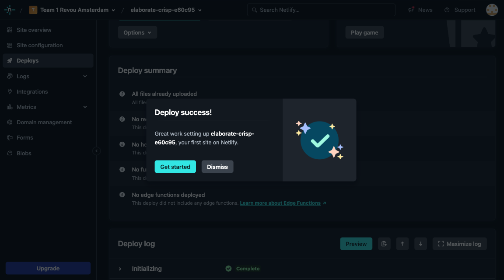
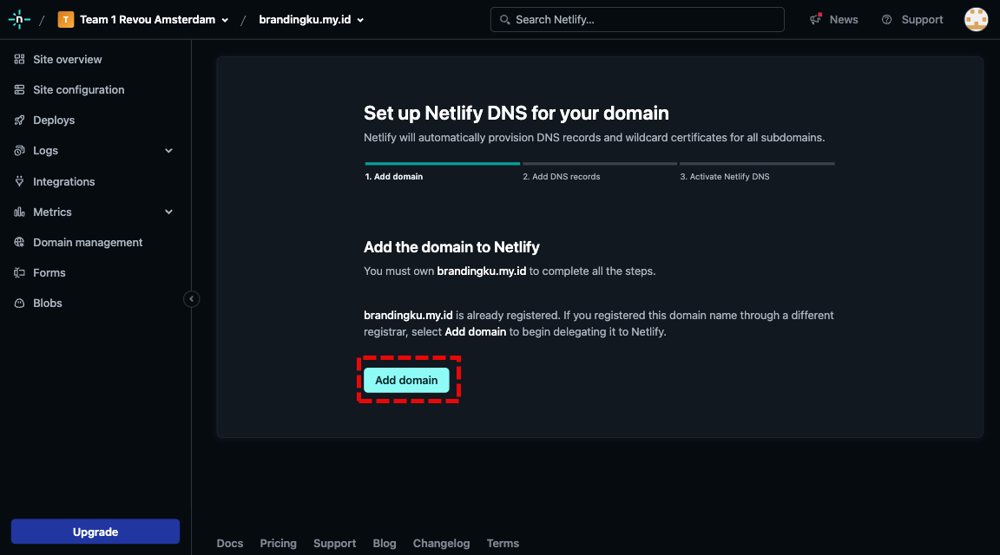
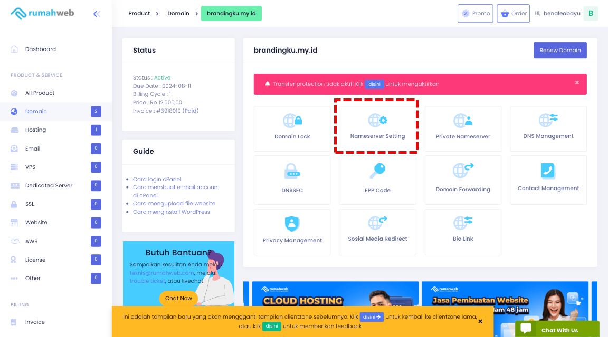

## Step Auto Deploy Github on Netlify
---

1. Visit netlify page for sign up first
   
- Click Login with Github

2. Login github
   

3. Fill your personal data

4. Click option 'Deploy with Github'

5. Configure Netlify on Github

6. Select your main repository to be connect on Netlify

7. Grants access for netlify permissions 

8. Select the repository to be connect to auto deployment 

9. Confirm the Deploy

10. Wait for a moment and you will see Success Deploy

11. Click 'Domain Management' for configure your custom domain

12. Click Add a domain

13. Input your domain  and click verify

14. Confirm a Domain

15. You will see domain already registered

16. For configure your custom domain, click the Options and click Set up Netlify DNS

17. Verify the DNS

18. Click 'Add domain' to configure

19. You can click 'Continue' for the next steps

20. You will get the name server for configure on your server domain

21. Login to your domain (my domain from rumahweb)

22. Manage you domain

23. Click menu where to use name server

24. Setting the name server from netlify

25. If success you will see the popup notification

26. Next verify DNS Configuration

27. If success you will see checklist for configured the DNS

28. See on Production Domain you will see Netlify DNS was checked

29. If you click the name of domain will directed the online domain with your code

