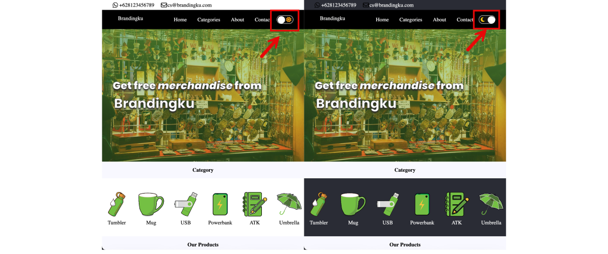
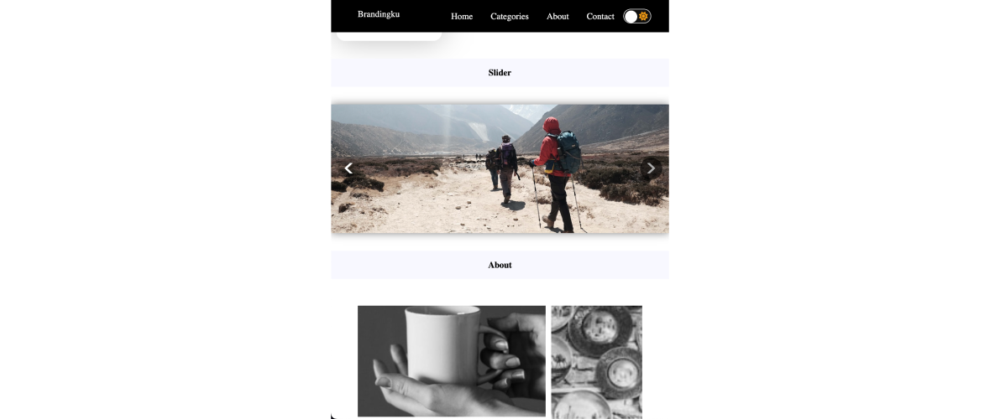
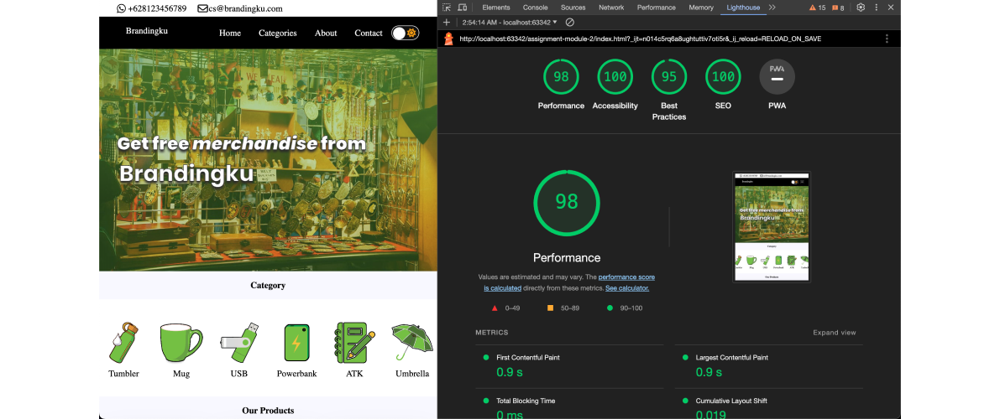
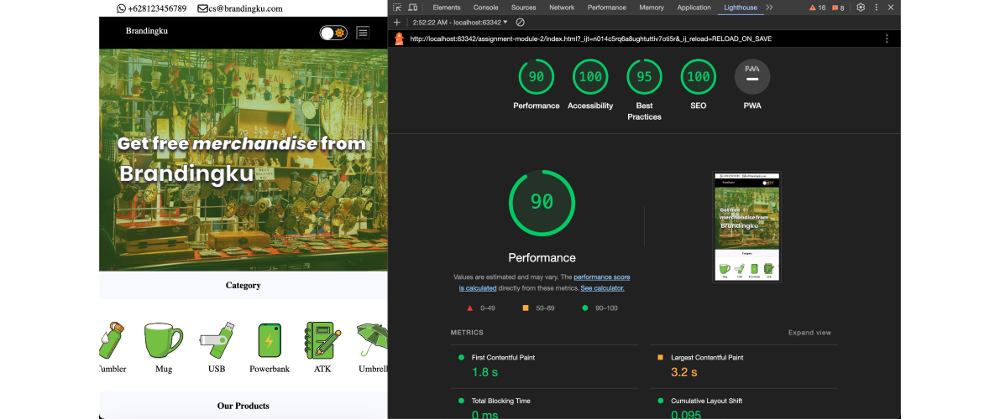
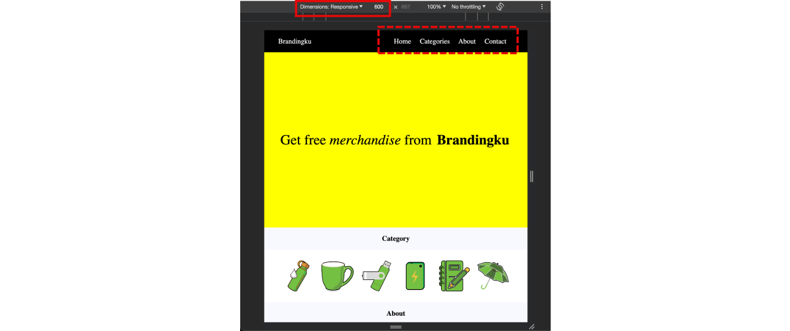

## Module 2 - Assignment with Advanced Implementation

This is for assignment module 2 FSSE Class of Jan 2024, Web Development Essentials.

The deadline for this task at Friday, Mar 1 2024

checkout my live link with custom domain at : [HERE !](https://brandingku.my.id)

my live link on netlify subdomain has going on : [HERE !](https://brandingku.netlify.app/)

---
## Step Auto Deploy Github on Netlify

### You can see the installment guide at : [HERE !](./GUIDE.md) 
## Features in this page build on module 2

### 1. Darkmode

_if you click on the toggle, its be open function on/off the dark mode_

### 2. Carousel Slider Without JS

_You can change the slider with navigation previous or next the image_

### 3. Lighthouse Score

_Image Lighthouse Desktop_

_Image Lighthouse Mobile_

## Features in this page from module 1

#### 1. Responsive Navbar

_You will see complete menu in above 550px width resolution_

_- You will see hamburger icon at the top-right in below 550px width resolution_

_- If you click the hamburger icon, you will see sidebar with all menu_

#### 2. Grid Layouts on Products
_- In this page on section products has styling with grid responsive_

#### 3. Animate transition popup

_- If you click the submit button, you will see alert notification_

_- You also can click the close button at the popup and alert notification can be hiding_

---

Let's learn more about software engineers

